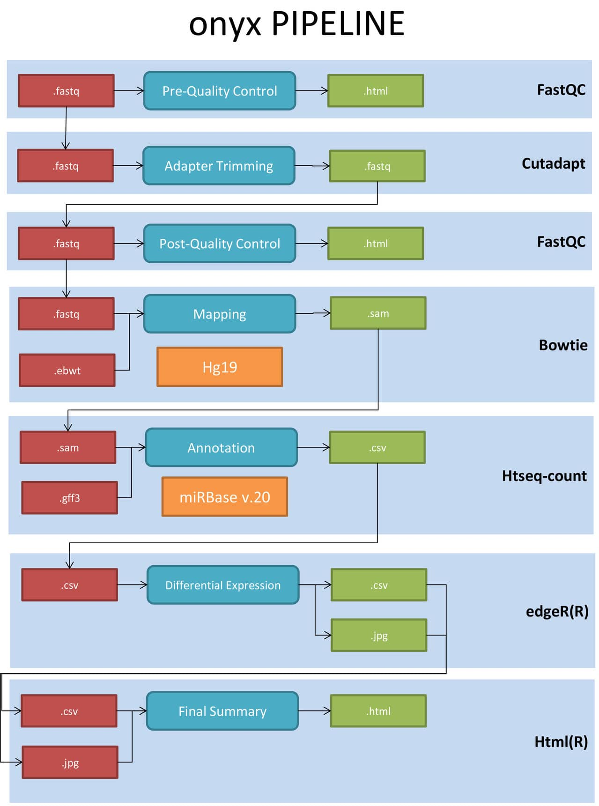

onyx
====

miRNA Differential Expression Analysis

Onyx allows the annotation and calculus of know miRNA differential expression levels from High-Throughput sequencing data.This Pipeline consist in Quality Analysis, Trimming, Mapping, Annotation and Expression Analysis.According with the studies puublished It is compatible with match-pair and non match-pair experimental design. The output is a summary of the normalized levels (TMM), the log Fold Change (logFC), the P Value, and the False Discovery Rate (FDR).
